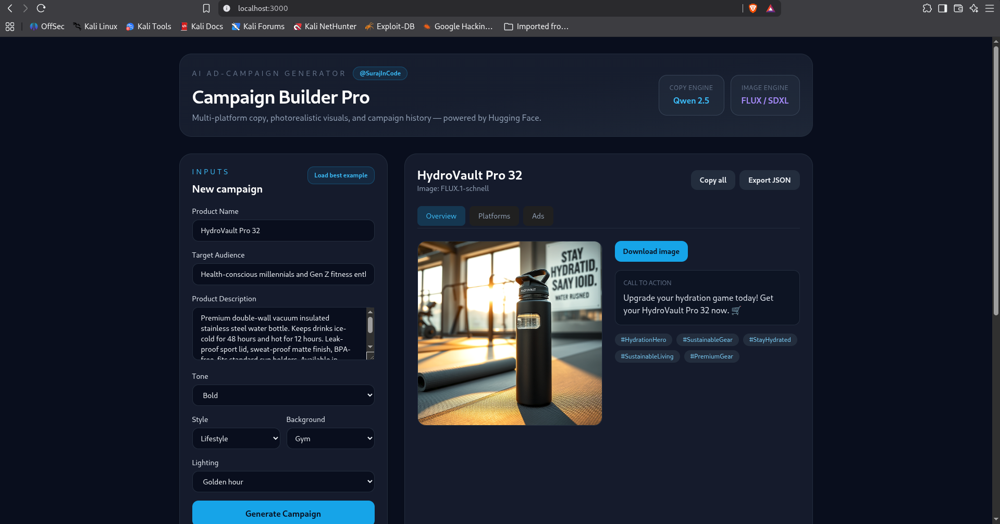
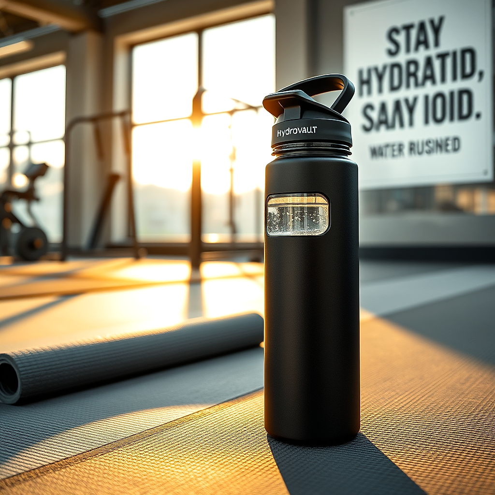

<div align="center">

<!-- ANIMATED HEADER BANNER -->


<!-- BADGE ROW 1: CORE STACK -->
<p>
  
  
  
  
  
</p>

<!-- BADGE ROW 2: AI MODELS + TOOLS -->
<p>
  
  
  
  
  
</p>

<!-- BADGE ROW 3: STATUS + AUTHOR -->
<p>
  
  
  
  
  
  
</p>

<br/>

> **From product brief → multi-platform ad copy + photorealistic promo image in one workflow.**  
> Orchestrating **Qwen 2.5** for copywriting and **FLUX / SDXL** for image synthesis — powered entirely by Hugging Face Cloud.

<br/>

**Built by [SurajInCode](https://github.com/SurajInCode)**

</div>

---

## 📸 Interface Showcase

### 🔷 Campaign Input Dashboard

> The dark-mode control console — define your product, audience, tone, and visual style to fuel the AI pipeline.

```
┌─────────────────────────────────────────────────────────────────────┐
│                                                                     │
│   📋 Campaign Builder Pro  ─────────────────────────  localhost:3000 │
│                                                                     │
│   Product Name        [  HydroVault Pro 32                        ] │
│   Description         [  Premium insulated steel bottle, 48hr cold ] │
│   Target Audience     [  Fitness enthusiasts aged 22–35           ] │
│   Tone                [  ● Bold   ○ Professional   ○ Witty        ] │
│   Visual Style        [  Lifestyle  │  Background: Gym            ] │
│   Lighting            [  Golden hour                               ] │
│                                                                     │
│              [ 🚀  Load best example  ]  [ Generate Campaign ]      │
│                                                                     │
└─────────────────────────────────────────────────────────────────────┘
```

<div align="center">



*Split-screen dark console — product specs feed directly into the dual-stage AI pipeline.*

</div>

---

### 🔷 Generated Output — Copy + Visual

> Two-stage execution: **Qwen 2.5** renders platform-optimized copy while **FLUX / SDXL** synthesizes the promotional visual.

```
┌─────────────────────────────────────────────────────────────────────┐
│  ✅ Generation Complete — Multi-Platform Copy + Visual Asset        │
├─────────────────────────────────────────────────────────────────────┤
│                                                                     │
│  📱 Instagram    "Stay hydrated. Stay unstoppable. 💪"              │
│  📘 Facebook     "Engineered for athletes who never slow down…"   │
│  🐦 Twitter/X    "48hr cold. Zero leaks. Pure performance."         │
│  💼 LinkedIn     "Innovation meets hydration for modern athletes…"  │
│                                                                     │
│  #️⃣  Hashtags   #Fitness #Hydration #HydroVault #GymLife           │
│  📣 CTA          "Shop now — link in bio"                             │
│                                                                     │
├─────────────────────────────────────────────────────────────────────┤
│  🖼️  FLUX / SDXL Synthesized Visual  ────  [base64 → PNG]           │
│  ┌───────────────────────────────────────────────────────────────┐  │
│  │                   [ Promo Image Here ]                        │  │
│  └───────────────────────────────────────────────────────────────┘  │
└─────────────────────────────────────────────────────────────────────┘
```

<div align="center">



*Platform copy + AI-synthesized promo visual — saved to MongoDB and reloadable from history.*

</div>

---

## ✨ Key Features

| Feature | Description |
|---|---|
| 🔗 **Two-Stage AI Orchestration** | Qwen 2.5 → refined image prompt → FLUX / SDXL in one seamless pipeline |
| 📱 **Multi-Platform Copy** | Instagram, Facebook, Twitter/X, LinkedIn + 3 ad variants + CTA + hashtags |
| 🎨 **Visual Style Controls** | Studio / Lifestyle / Outdoor / Flat lay + background + lighting presets |
| 🤖 **Smart Prompt Engineering** | Dedicated LLM pass for photorealistic commercial photography prompts |
| 🖼️ **Image Model Fallback** | FLUX.1-dev → FLUX.1-schnell → SDXL automatic failover |
| ✨ **Post-Processing** | Sharp sharpening + color enhancement on every generated image |
| 💾 **Campaign History** | MongoDB persistence — browse and reload past campaigns |
| 📋 **Export & Copy** | Copy all assets to clipboard or download campaign as JSON |
| 🎯 **Demo Example** | One-click "Load best example" for instant testing |
| 🔒 **Production-Ready Security** | Helmet, CORS, rate limiting, input validation, token verification |

---

## 🏗️ Architecture Overview

```
┌──────────────────────────────────────────────────────────────────────┐
│                        USER BROWSER :3000                            │
│                  React 18  +  Tailwind CSS  +  Vite 8                │
└──────────────────────────┬───────────────────────────────────────────┘
                           │  HTTP POST /api/campaigns/generate
                           ▼
┌──────────────────────────────────────────────────────────────────────┐
│                  BACKEND  —  Node.js + Express  :5000                │
│                                                                      │
│   ┌─────────────────────┐        ┌──────────────────────────────┐  │
│   │  Stage 1: Ad Copy   │        │  Stage 2: Image Prompt       │  │
│   │  Qwen 2.5 7B        │──────▶ │  Qwen 2.5 7B (photography)   │  │
│   │  (multi-platform)   │        │  + style/background/lighting │  │
│   └─────────────────────┘        └──────────────┬───────────────┘  │
│                                                  │                   │
│                                                  ▼                   │
│                              ┌──────────────────────────────┐       │
│                              │  Stage 3: Image Synthesis    │       │
│                              │  FLUX.1-dev → schnell → SDXL │       │
│                              │  Stage 4: Sharp enhance      │       │
│                              └──────────────────────────────┘       │
│                                                                      │
│                    @huggingface/inference SDK                        │
└──────────────────────────┬───────────────────────────────────────────┘
                           │
                           ▼
┌──────────────────────────────────────────────────────────────────────┐
│                    MongoDB  —  Mongoose ODM                          │
│              Campaign schema · history · asset persistence           │
└──────────────────────────────────────────────────────────────────────┘
```

---

## 🛠️ Tech Stack

<div align="center">

| Layer | Technology |
|---|---|
| **Frontend** | React 18, Vite 8, Tailwind CSS 3 |
| **Backend** | Node.js, Express 4, Helmet, express-rate-limit |
| **Database** | MongoDB, Mongoose 7 |
| **AI — Copywriting** | Qwen 2.5 7B Instruct via Hugging Face |
| **AI — Image Gen** | FLUX.1-dev, FLUX.1-schnell, SDXL via Hugging Face |
| **AI SDK** | `@huggingface/inference` (official) |
| **Image Processing** | Sharp |

</div>

---

## 🚀 Local Setup

### Prerequisites

- ✅ Node.js `v18+`
- ✅ MongoDB running locally (`mongod`) or MongoDB Atlas URI
- ✅ Hugging Face account with Inference token — [get one here](https://huggingface.co/settings/tokens)

### 1. Clone the Repository

```bash
git clone https://github.com/SurajInCode/ai-ad-campaign-generator.git
cd ai-ad-campaign-generator
```

### 2. Configure Backend

```bash
cd backend
npm install
cp .env.example .env
```

Edit `backend/.env` — set your **real** token (starts with `hf_`):

```env
PORT=5000
NODE_ENV=development
MONGO_URI=mongodb://localhost:27017/ad_campaign_generator
HF_TOKEN=hf_your_actual_token_here
CORS_ORIGINS=http://localhost:3000,http://127.0.0.1:3000
```

> ⚠️ **Never** put your real token in `.env.example` — only in `backend/.env` (gitignored).

Verify your token:

```bash
npm run check-env
# ✅ Token is valid and verified with Hugging Face
```

### 3. Configure Frontend

```bash
cd ../frontend
npm install
```

### 4. Launch the Stack

**Terminal 1 — Backend:**

```bash
cd backend
npm start
# ✅ Connected to MongoDB
# ✅ Hugging Face token verified
# 🚀 Server is running on port 5000
```

**Terminal 2 — Frontend:**

```bash
cd frontend
npm run dev
# ➜  Local: http://localhost:3000
```

Open **[http://localhost:3000](http://localhost:3000)** → click **Load best example** → **Generate Campaign** 🎉

---

## 🧠 AI Pipeline — How It Works

```
User Input (Product + Audience + Tone + Visual Style)
        │
        ▼
┌──────────────────────────────────┐
│  STAGE 1 — Multi-Platform Copy   │
│  Model: Qwen 2.5 7B Instruct     │
│  Output: Instagram, Facebook,    │
│  Twitter/X, LinkedIn, hashtags,  │
│  CTA + 3 ad variants             │
└──────────────────┬───────────────┘
                   │
                   ▼
┌──────────────────────────────────┐
│  STAGE 2 — Image Prompt Refine   │
│  Model: Qwen 2.5 7B Instruct     │
│  + style / background / lighting │
│  Output: photorealistic prompt   │
└──────────────────┬───────────────┘
                   │
                   ▼
┌──────────────────────────────────┐
│  STAGE 3 — Image Synthesis       │
│  FLUX.1-dev → schnell → SDXL     │
│  Output: base64 PNG promo image  │
└──────────────────┬───────────────┘
                   │
                   ▼
┌──────────────────────────────────┐
│  STAGE 4 — Enhance (Sharp)       │
│  Sharpen + color boost           │
└──────────────────┬───────────────┘
                   │
                   ▼
         Campaign saved to MongoDB
         + Results returned to React UI
```

---

## 🎯 Best Demo Input

Click **"Load best example"** in the UI, or paste manually:

| Field | Value |
|---|---|
| **Product Name** | `HydroVault Pro 32` |
| **Description** | Premium double-wall vacuum insulated stainless steel water bottle. Keeps drinks ice-cold for 48 hours. Leak-proof sport lid, BPA-free, matte finish. |
| **Target Audience** | Health-conscious millennials and Gen Z fitness enthusiasts aged 22–35 |
| **Tone** | Bold |
| **Visual Style** | Lifestyle |
| **Background** | Gym |
| **Lighting** | Golden hour |

---

## 📡 API Reference

| Method | Endpoint | Description |
|---|---|---|
| `GET` | `/api/health` | Server status + HF token check |
| `GET` | `/api/campaigns?limit=10` | List recent campaigns |
| `GET` | `/api/campaigns/:id` | Get full campaign by ID |
| `POST` | `/api/campaigns/generate` | Generate new campaign (10 req / 15 min) |

<details>
<summary><strong>POST /api/campaigns/generate — Request body</strong></summary>

```json
{
  "productName": "HydroVault Pro 32",
  "productDescription": "Premium insulated stainless steel water bottle...",
  "targetAudience": "Fitness enthusiasts aged 22-35",
  "tone": "Bold",
  "visualStyle": "Lifestyle",
  "background": "Gym",
  "lighting": "Golden hour"
}
```

| Field | Allowed Values |
|---|---|
| `tone` | Bold, Professional, Witty, Casual |
| `visualStyle` | Studio, Lifestyle, Outdoor, Flat lay |
| `background` | White seamless, Wood table, Gym, Nature, Kitchen |
| `lighting` | Soft studio, Golden hour, Bright daylight, Dramatic |

</details>

---

## 📁 Project Structure

```
ai-ad-campaign-generator/
├── 📂 frontend/
│   ├── src/
│   │   ├── App.jsx              # Campaign builder UI
│   │   ├── main.jsx
│   │   └── index.css
│   ├── index.html
│   ├── vite.config.js
│   └── package.json
│
├── 📂 backend/
│   ├── middleware/
│   │   ├── validateCampaign.js
│   │   ├── rateLimiter.js
│   │   └── errorHandler.js
│   ├── models/
│   │   └── Campaign.js
│   ├── routes/
│   │   └── campaignRoutes.js
│   ├── services/
│   │   ├── huggingfaceService.js
│   │   ├── imageService.js
│   │   └── promptBuilder.js
│   ├── utils/
│   │   └── validateHfToken.js
│   ├── scripts/
│   │   └── check-env.js
│   ├── server.js
│   ├── .env.example
│   └── package.json
│
├── 📂 screenshots/
│   ├── dashboard.png.png
│   └── flux_output.png.png
│
├── LICENSE
└── README.md
```

---

## 🔒 Security

| Measure | Details |
|---|---|
| Secrets | `backend/.env` gitignored — never commit `HF_TOKEN` |
| Token validation | Verified on startup + before every generation |
| CORS | Restricted to `CORS_ORIGINS` (localhost auto-allowed in dev) |
| Rate limiting | 10 generations / 15 min · 100 API calls / 15 min |
| Input validation | Max lengths, allowed enums, control-char stripping |
| Headers | Helmet security headers enabled |
| Production | Generic error messages when `NODE_ENV=production` |

**Before pushing to GitHub:**

```bash
git status                          # .env should NOT appear
npm run check-env                   # token works locally
grep -r "hf_" backend/.env.example  # should return empty HF_TOKEN=
```

---

## 🩺 Troubleshooting

| Problem | Fix |
|---|---|
| `HF_TOKEN is missing or placeholder` | Edit `backend/.env` (not `.env.example`) with real `hf_...` token |
| `Invalid Hugging Face token` | Create new token with **Inference** permission at [HF settings](https://huggingface.co/settings/tokens) |
| Yellow banner in UI | Run `cd backend && npm run check-env` |
| Rate limit (429) | Wait 15 minutes, then retry |
| Model loading (503) | Wait 30 seconds and retry (cold start) |
| CORS error | Use port 3000 or add your URL to `CORS_ORIGINS` |
| MongoDB failed | Run `mongod` or set valid `MONGO_URI` |

---

## 🗺️ Roadmap

- [x] Multi-platform ad copy (Instagram, Facebook, Twitter/X, LinkedIn)
- [x] Two-stage AI prompt pipeline
- [x] FLUX / SDXL image generation with fallback
- [x] Visual style, background, and lighting controls
- [x] Campaign history and JSON export
- [x] Security hardening (Helmet, CORS, rate limits)
- [ ] PDF / ZIP export of campaign assets
- [ ] User authentication and saved workspaces
- [ ] Scheduling integration (Meta Ads API, LinkedIn API)
- [ ] Campaign analytics dashboard

---

## 🤝 Contributing

Pull requests are welcome. For major changes, please open an issue first.

```bash
git checkout -b feature/your-feature-name
git commit -m "feat: add your feature"
git push origin feature/your-feature-name
```

---

## 📄 License

This project is licensed under the [MIT License](LICENSE).

---

<div align="center">


**Built with ❤️ by [SurajInCode](https://github.com/SurajInCode)**

React · Node.js · MongoDB · Hugging Face

<br/>

⭐ Star this repo if it helped you build something cool!

</div>
