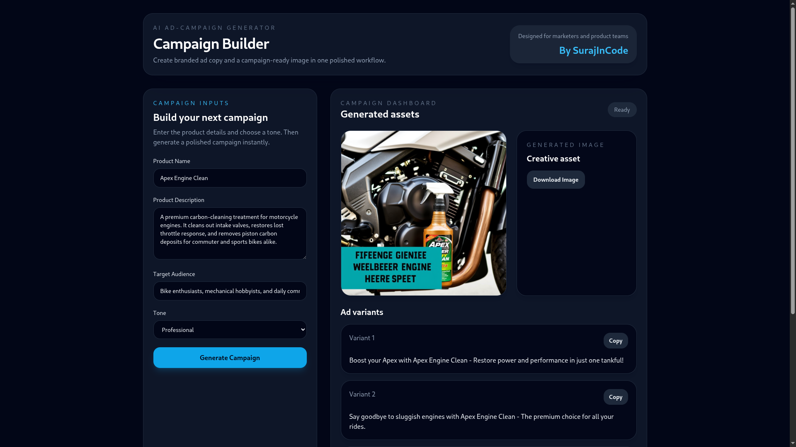

<div align="center">

<!-- ANIMATED HEADER BANNER -->


<!-- BADGE ROW 1: CORE STACK -->
<p>
  
  
  
  
  
</p>

<!-- BADGE ROW 2: AI MODELS + INFRA -->
<p>
  
  
  
  
  
</p>

<!-- BADGE ROW 3: STATUS + META -->
<p>
  
  
  
  
  
  
</p>

<br/>

> **From raw product idea → production-ready ad copy + hyper-realistic visuals in seconds.**  
> Orchestrating `Qwen-2.5-7B-Instruct` for copywriting and `FLUX.1-schnell` for image synthesis — all in one unified pipeline.

<br/>

</div>

---

## 📸 Interface Showcase

### 🔷 Campaign Input Dashboard

> The sleek, dark-mode control console — define your product, audience, and tone to fuel the AI pipeline.

```
┌─────────────────────────────────────────────────────────────────────┐
│                                                                     │
│   📋 Campaign Builder  ────────────────────────────  localhost:3000 │
│                                                                     │
│   Product Name        [  Sleek Bottle                            ]  │
│   Description         [  Insulated titanium, 48-hr cold hold... ]  │
│   Target Audience     [  Gym goers and hikers                    ]  │
│   Tone                [  ● Bold   ○ Playful   ○ Professional     ]  │
│   Platforms           [  ✅ Instagram  ✅ Facebook  ✅ LinkedIn   ]  │
│                                                                     │
│                        [ 🚀  Generate Campaign Assets ]             │
│                                                                     │
└─────────────────────────────────────────────────────────────────────┘
```

<div align="center">

> 📂 **dashboard screenshot**


*Split-screen dark console — product specs feed directly into the dual-model AI pipeline.*

</div>

---

### 🔷 Generated Output — Copy + Visual

> Dual-model execution: `Qwen-2.5-7B-Instruct` renders 3 platform-optimized copy variants while `FLUX.1-schnell` synthesizes the promotional visual simultaneously.

```
┌─────────────────────────────────────────────────────────────────────┐
│  ✅ Generation Complete — 3 Copy Variants + 1 Visual Asset          │
├─────────────────────────────────────────────────────────────────────┤
│                                                                     │
│  📱 Instagram / Meta (Variant 1)                                    │
│  "Ditch the plastic. Forge your path. 100% pure titanium —          │
│   built to hold zero temperatures for 48 hours straight."           │
│                                                                     │
│  📘 Facebook / Meta (Variant 2)                                     │
│  "Engineered for the wild. Built for heavy hitters. Keeps           │
│   hydration bone-chillingly cold — gym session to mountain peak."   │
│                                                                     │
│  💼 LinkedIn Post                                                   │
│  "Innovation meets hydration. The titanium insulation solution      │
│   for athletes and backcountry explorers. #MaterialScience"         │
│                                                                     │
├─────────────────────────────────────────────────────────────────────┤
│  🖼️  FLUX.1-schnell Synthesized Visual  ────  [base64 → PNG]        │
│  ┌───────────────────────────────────────────────────────────────┐  │
│  │                   [ Promo Image Here ]                        │  │
│  └───────────────────────────────────────────────────────────────┘  │
└─────────────────────────────────────────────────────────────────────┘
```

<div align="center">

> 📂 **generation output screenshot**



*Copy variants + AI-synthesized promo visual rendered natively — all within a single request lifecycle.*

</div>

---

## ✨ Key Features

| Feature | Description |
|---|---|
| 🔗 **Dual-Stage AI Orchestration** | Chains `Qwen-2.5-7B-Instruct` → `FLUX.1-schnell` in one seamless pipeline |
| ✍️ **Context-Aware Copywriting** | Reads demographics and tone to produce high-converting copy variants |
| 🤖 **Automated Prompt Engineering** | Backend system prompts auto-generate optimized diffusion prompts internally |
| 🖼️ **Hyper-Realistic Image Synthesis** | Returns high-resolution base64 image assets via HuggingFace Inference SDK |
| 💾 **Persistent Campaign Memory** | MongoDB stores every campaign run with schema validation |
| 🌙 **Dark-Mode Minimalist UI** | Custom Tailwind dark theme with responsive grid and fluid async states |

---

## 🏗️ Architecture Overview

```
┌──────────────────────────────────────────────────────────────────────┐
│                        USER BROWSER :3000                            │
│                  React.js  +  Tailwind CSS  +  Axios                 │
└──────────────────────────┬───────────────────────────────────────────┘
                           │  HTTP POST /api/generate
                           ▼
┌──────────────────────────────────────────────────────────────────────┐
│                  BACKEND  —  Node.js + Express.js  :5000             │
│                                                                      │
│   ┌─────────────────────┐        ┌──────────────────────────────┐   │
│   │  Stage 1: LLM Copy  │        │  Stage 2: Image Synthesis    │   │
│   │  Qwen-2.5-7B-Instr  │──────▶ │  FLUX.1-schnell              │   │
│   │  (3 ad variants)    │        │  (base64 PNG output)         │   │
│   └─────────────────────┘        └──────────────────────────────┘   │
│                                                                      │
│                    @huggingface/inference SDK                        │
└──────────────────────────┬───────────────────────────────────────────┘
                           │
                           ▼
┌──────────────────────────────────────────────────────────────────────┐
│                    MongoDB  —  Mongoose ODM                          │
│              Campaign schema storage & history persistence           │
└──────────────────────────────────────────────────────────────────────┘
```

---

## 🛠️ Tech Stack

<div align="center">

| Layer | Technology |
|---|---|
| **Frontend** | React.js (Hooks), Tailwind CSS, Axios |
| **Backend** | Node.js, Express.js |
| **Database** | MongoDB, Mongoose ODM |
| **AI — Copywriting** | Qwen-2.5-7B-Instruct via HuggingFace |
| **AI — Image Gen** | FLUX.1-schnell via HuggingFace |
| **AI SDK** | `@huggingface/inference` (official) |

</div>

---

## 🚀 Local Setup

### Prerequisites

- ✅ Node.js `v18+`
- ✅ MongoDB running locally (`mongod`)
- ✅ HuggingFace User Access Token ([get one here](https://huggingface.co/settings/tokens))

### 1. Clone the Repository

```bash
git clone https://github.com/yourusername/ai-ad-campaign-generator.git
cd ai-ad-campaign-generator
```

### 2. Configure Backend

```bash
cd backend
npm install
touch .env
```

Populate `.env`:

```env
PORT=5000
MONGO_URI=mongodb://localhost:27017/ad_campaign_generator
HF_TOKEN=your_huggingface_access_token_here
```

### 3. Configure Frontend

```bash
cd ../frontend
npm install
```

### 4. Launch the Stack

**Terminal 1 — Backend:**
```bash
cd backend
npm start
# ✅ Connected to MongoDB | 🚀 Server running on port 5000
```

**Terminal 2 — Frontend:**
```bash
cd frontend
npm run dev
# ➜  Local: http://localhost:3000
```

Open **[http://localhost:3000](http://localhost:3000)** in your browser. 🎉

---

## 🧠 AI Pipeline — How It Works

```
User Input (Product + Audience + Tone)
        │
        ▼
┌──────────────────────────────────┐
│  STAGE 1 — LLM Copywriting       │
│  Model: Qwen-2.5-7B-Instruct     │
│  Output: 3 platform-specific     │
│  ad copy variants + a structured │
│  FLUX diffusion prompt           │
└──────────────────┬───────────────┘
                   │  (diffusion prompt)
                   ▼
┌──────────────────────────────────┐
│  STAGE 2 — Image Synthesis       │
│  Model: FLUX.1-schnell           │
│  Output: High-res base64 PNG     │
│  promotional graphic             │
└──────────────────────────────────┘
        │
        ▼
  Campaign saved to MongoDB
  + Results returned to React UI
```

---

## 📁 Project Structure

```
ai-ad-campaign-generator/
├── 📂 frontend/
│   ├── src/
│   │   ├── components/       # React UI components
│   │   ├── App.jsx           # Root application shell
│   │   └── main.jsx          # Vite entry point
│   ├── tailwind.config.js
│   └── package.json
│
├── 📂 backend/
│   ├── routes/
│   │   └── campaign.js       # /api/generate endpoint
│   ├── models/
│   │   └── Campaign.js       # Mongoose schema
│   ├── services/
│   │   └── huggingface.js    # AI inference pipeline
│   ├── server.js             # Express entry point
│   └── package.json
│
├── 📂 screenshots/
│   ├── dashboard.png         # Input UI screenshot
│   └── flux_output.png       # Generation output screenshot
│
└── README.md
```

---

## 🗺️ Roadmap

- [x] Dual-model AI pipeline (copy + image)
- [x] MongoDB campaign history persistence
- [x] Dark-mode React UI
- [ ] Bulk campaign batch generation mode
- [ ] PDF/ZIP export of campaign assets
- [ ] Scheduling integration (Meta Ads API, LinkedIn API)
- [ ] User authentication + saved workspaces
- [ ] Fine-tuned model support (custom brand voice)

---

## 🤝 Contributing

Pull requests are welcome. For major changes, please open an issue first to discuss what you'd like to change.

```bash
# Fork → Clone → Branch → PR
git checkout -b feature/your-feature-name
git commit -m "feat: add your feature"
git push origin feature/your-feature-name
```

---

## 📄 License

## 📄 License

This project is licensed under the MIT License - see the [LICENSE](LICENSE) file for details.
---

<div align="center">


**Built with ❤️ using React · Node.js · MongoDB · HuggingFace**

⭐ Star this repo if it helped you build something cool!

</div>